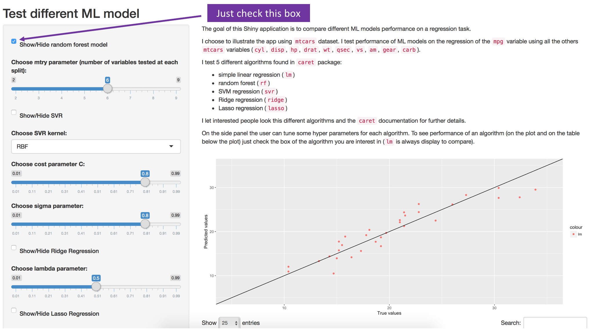

```{r setup, include=FALSE}
knitr::opts_chunk$set(echo = FALSE)

library(shiny)
library(dplyr)
library(ggplot2)
library(caret)
library(MLmetrics)

data("mtcars")
```

## App pitch (1)

The goal of this Shiny application is to compare different ML models performance on a regression task.

I choose to illustrate the app using `mtcars` dataset. I test performance of ML models on the regression of the `mpg` variable using all the others `mtcars` variables (`cyl`, `disp`, `hp`, `drat`, `wt`, `qsec`, `vs`, `am`, `gear`, `carb`).

I test 5 different algorithms found in `caret` package:

* simple linear regression (`lm`)
* random forest (`rf`)
* SVM regression (`svr`)
* Ridge regression (`ridge`)
* Lasso regression (`lasso`)

## App pitch (2)

I let interested people look this different algorithms and the `caret` documentation for further details.

On the side panel the user can tune some hyper parameters for each algorithm. To see performance of an algorithm (on the plot and on the table below the plot) just check the box of the algorithm you are interest in (`lm` is always display to compare).

Work can be continue by adding other ML models and may integrate more data science work like feature pre processing for example.

## Usage

If you want to compare an implemented model, you just have to check the corresponding box ("Show/Hide random forest model"). For example if you want to see Random Forest performance you just check the corresponding box like on the image and model performance will appear in the app.

```{r, out.width = "500px"}

```

## Example: RF model

For example, let's explain how app works for random forest model

First we train the model

```{r}
input <- list()
input$mtry <- 6
```

```{r echo = TRUE}
fitControl <- trainControl(method = "none")
rf_param <- data.frame(mtry = input$mtry)
# let's pretend that the user have fixed mtry paramater at 6
model_rf <- train(mpg ~ ., data = mtcars, method = "rf",
                  trControl = fitControl, tuneGrid = rf_param)
rf_fitted_values <- predict(model_rf,
                            mtcars[, !(colnames(mtcars) %in% c("mpg"))])
```

Then we can compute `RMSPE` and `MAPE` using `MLmetrics` library

And finally we just have to add the `RMSPE` and `MAPE` to the result table and the fitted values on the plot.